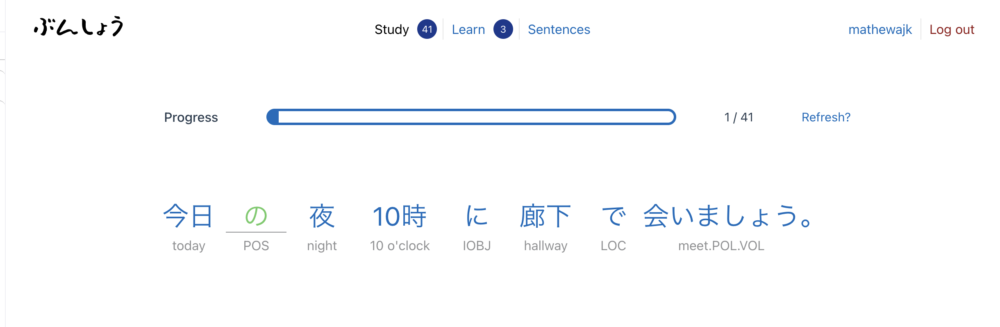

# bunsho

Have you ever wanted to use linguistic glosses to study a language, rather than relying on lossy translations? No? Well, too bad, because that's what this app does.

bunsho is a spaced-repetition, massive cloze-deletion studying app where words are mapped to glosses. This contrasts with the traditional approach of mapping entire sentences to translations, which are inherently less 1:1. Moving away from translations is an important step in learning to think directly in a new language. bunsho aims to help bridge that gap.

### Do I need to be a linguist to use this?

Nah. You can write whatever you want as the translation for each word. They don't *have* to be proper glosses. (But you might benefit from studying these a bit!)